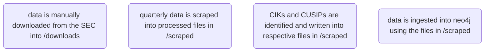

# BAG35 CLI
repo for all things related to BAG35

## Design
### Quarterly 13F Data
At a high level, the general process for gathering and processing 13F data is as follows:

scraping is synchonous, extracting from downloaded data
identification is asynchronous, using external sources to query for data— however it is idempotent
ingestion is [using merge but is it idempotent? test this]

