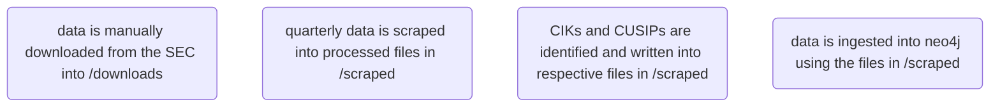

# BAG35 CLI
repo for all things related to BAG35

## Design
### Quarterly 13F Data
#### Gathering and processing data
At a high level, the general process for gathering and processing 13F data is as follows:

scraping is synchonous, extracting from downloaded data
identification is asynchronous, using external sources to query for data— however it is idempotent
ingestion is synchonous as well
for ingestion:
 - entity ingestion is idempotent
 - equity ingestion is idempotent
 - submission ingestion is idempotent

#### 13F Glossary and Relationships
CIK
CUSIP
Submission type
  13F-HR Initial Quarterly Form 13F Holdings Report filed by institutional managers
  13F-HR/A Amendment to a Quarterly Form 13F Holdings Report filed by institutional managers
  13F-NT Initial Quarterly Form 13F Notice Report filed by institutional managers
  13F-NT/A Amendment to a Quarterly Form 13F Notice Report filed by institutional managers
ACCESSION_NUMBER

#### Amendments
When a report is amended, the amendment will use the same period of report (PERIODOFREPORT) as the filing that is being ammended

it appears that ammendments are a complete refiling, rather than a diff of changes to be made

[ more in notion ](https://www.notion.so/How-can-we-extract-form-13f-data-87ffa119d34648b7abbe8f416a2eb87b#35b162a557474803934b30c980468a54)